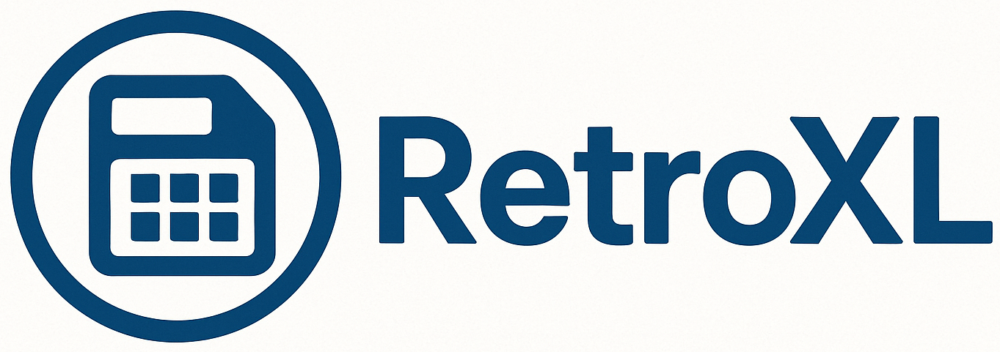

# RetroXL — Legacy-Compatible XLS Generation for Modern Go Applications

<p align="center">
  
</p>
<p align="center">
  <a href="https://pkg.go.dev/github.com/mhshajib/retroxl"></a>
  <a href="https://goreportcard.com/report/github.com/mhshajib/retroxl"></a>
  <a href="LICENSE"></a>
</p>

A small Go library for converting modern spreadsheet data to legacy-like XLS files.

`RetroXL` is a lightweight Go library for generating legacy-compatible `XLS` files from modern spreadsheet data. It converts `XLSX`, `CSV`, `TSV`, and in-memory tabular structures into Excel-friendly `.xls` outputs — all without external binaries or system dependencies. `RetroXL` produces SpreadsheetML-based `XLS` files that open seamlessly in Excel and satisfy strict legacy upload systems such as banking portals. The API supports both `file-path` inputs and `in-memory streams`, allowing you to write directly to `disk`, return `bytes` in an API response, or upload to `S3` like cloud storage — all from pure Go.

Repository: https://github.com/mhshajib/retroxl

## Features

- Convert from modern formats to `.xls`:
  - `.xlsx`
  - `.csv`
  - `.tsv`
- Use file paths or in-memory data.
- Write output to:
  - a file on disk
  - a `[]byte`
  - any `io.Writer` (HTTP response, S3 upload, etc.)

## Installation

```bash
go get github.com/mhshajib/retroxl
```

## Basic usage

### Convert an existing `.xlsx` file to `.xls` on disk

```go
package main

import (
    "log"

    "github.com/mhshajib/retroxl"
)

func main() {
    if err := retroxl.ConvertXLSXToXLSFile("input.xlsx", "output.xls"); err != nil {
        log.Fatalf("convert failed: %v", err)
    }
}
```

### Generate a bank upload file from in-memory data

```go
package main

import (
    "log"

    "github.com/mhshajib/retroxl"
)

func main() {
    headers := []string{"AccountNo", "Amount", "Reference"}
    rows := [][]any{
        {"1234567890", 1200.50, "Invoice-2025-001"},
        {"0987654321", 300.00,  "Invoice-2025-002"},
    }

    sheet := retroxl.FromRows("BankUpload", headers, rows)

    if err := retroxl.WriteXLSFile("bank_upload.xls", []retroxl.Sheet{sheet}); err != nil {
        log.Fatalf("write xls failed: %v", err)
    }
}
```

### Stream XLS content over HTTP

```go
package main

import (
    "log"
    "net/http"

    "github.com/mhshajib/retroxl"
)

func bankHandler(w http.ResponseWriter, r *http.Request) {
    headers := []string{"AccountNo", "Amount", "Reference"}
    rows := [][]any{
        {"1234567890", 1200.50, "Invoice-2025-001"},
        {"0987654321", 300.00,  "Invoice-2025-002"},
    }

    sheet := retroxl.FromRows("BankUpload", headers, rows)

    w.Header().Set("Content-Type", "application/vnd.ms-excel")
    w.Header().Set("Content-Disposition", `attachment; filename="bank_upload.xls"`)

    if err := retroxl.WriteXLSWriter(w, []retroxl.Sheet{sheet}); err != nil {
        http.Error(w, "failed to generate xls", http.StatusInternalServerError)
        return
    }
}

func main() {
    http.HandleFunc("/bank-upload.xls", bankHandler)

    if err := http.ListenAndServe(":8080", nil); err != nil {
        log.Fatal(err)
    }
}
```

### Convert any supported path to XLS bytes

```go
data, err := retroxl.ConvertAnyToXLSBytes("input.xlsx")
if err != nil {
    // handle error
}

// data contains the XLS file content.
```

## API Overview

All types and functions are documented with GoDoc comments.

Key pieces:

- `type Sheet` – in-memory representation of a sheet
- `FromRows` – build a `Sheet` from headers and rows
- `WriteXLSFile` – write one or more sheets to a `.xls` file
- `WriteXLSBytes` – generate XLS content as `[]byte`
- `WriteXLSWriter` – stream XLS content to any `io.Writer`
- `XLSXToSheets` – read `.xlsx` from a path into `[]Sheet`
- `CSVToSheets` – read `.csv`/`.tsv` into `[]Sheet`
- `PathToSheets` – helper that dispatches by file extension
- `ConvertXLSXToXLSFile` / `ConvertXLSXToXLSBytes`
- `ConvertAnyToXLSFile` / `ConvertAnyToXLSBytes`

## Limitations

- The generated files are XML Spreadsheet 2003 wrapped in `.xls`.
  They are understood by Excel and many legacy systems that require
  `.xls`, but they are not BIFF8 binary workbooks.
- `retroxl` focuses on simple tabular data:
  - values are written as strings, numbers, or booleans
  - advanced Excel features such as formulas, styles, and merged cells
    are not currently supported.

## Contributing

Issues and pull requests are welcome at:

https://github.com/mhshajib/retroxl

Please include tests for any functional changes.

## Contributors

<a href="https://github.com/mhshajib/retroxl/graphs/contributors">
  
</a>

[](https://github.com/mhshajib/retroxl/graphs/contributors)

## License

`RetroXL` License (MIT + Attribution) © 2025 [Sajib Sikder](https://github.com/mhshajib)

This software may be freely used, modified, and distributed with proper attribution to the original author and repository.
See [LICENSE](./LICENSE).
